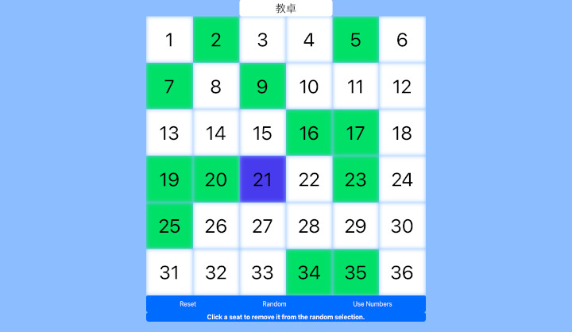

# [Classroom Volunteers](https://teflassistant.com/volunteers/)
An app to choose classroom "volunteers" without seat numbers or names.

## Purpose/Goal
This app removes the stress of a student feeling "singled out" by a teacher, and offers a fair way to determine volunteer order when a task is given.  

Often, students are too shy/lazy/unininterested/etc to raise their hand. In my schools the classes are often shuffled around for English class which makes choosing students based on seat number slightly annoying. This app can help speed things up because the students won't laze about wasting time deciding who goes first.

## Operation
* Click the "Random" button.
* Click a square to remove it from the random selection.
* Click the square again to put it back in the random selection.
* The squares represent the most common class arrangement (6x6).
* The most recently, randomly selected seat is a different color (so you dont have to remember which one is next).

## Tech/Libraries Used
* HTML
* CSS
* JavaScript
* React
* Bootstrap

## Problems/Solutions
Adding gridlines without using the border property took a few tries before I eventually settled on using an inset shadow to create the effect. All the other attempts to make the grid lines would do wierd things like change the dimensions of the elements which altered alignments. I learned that by simply changing the colors, I can get the effect I want without changing the layout.

## More Information
Ideas for future functionality:
* add a drag drop feature to customize the seating arrangements
* add other common classroom arrangements (lunch groups, etc)
